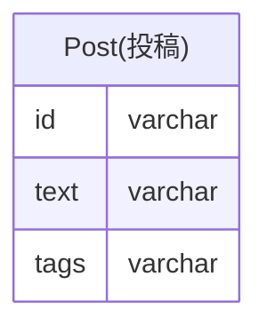

検索しやすいようにタグを設定して記事を投稿できるサービス。
「タグ名を変更したが、変更前の名前のタグがついた記事がある」と問い合わせがあったのでDB設計を調査してみた。

## 現状のテーブル構造


`tags`に`tagA,tagB,tagC`のようにカンマ区切りでタグの情報が格納されていた。

複数タグが設定されている投稿の更新がうまくいっていないようだ。
調べたところ、複数の値を持つ属性をカンマ区切りのリストで管理することは「ジェイウォーク(信号無視)」と呼ばれるDB設計のアンチパターンであることがわかった。

## 問題点
この設計には以下のような問題が発生してしまう。
- タグの変更が複雑になる
タグ名を変更する場合、カンマ区切りの文字列から該当タグを抽出して置き換える必要があるために複雑なクエリになってしまう。
```
UPDATE Post
SET tags = REGEXP_REPLACE(tags, '(^|,)tagA(,|$)', '\\1newTagA\\2')
WHERE tags REGEXP '(^|,)tagA(,|$)';
```

- 不正な値や重複、データ不整合が発生しやすい
カンマ区切りのリストには**FK(外部キー)制約**を設定できないので、DB側で不正なデータのチェックができず重複やデータ不整合が発生しやすくなってしまう。

- 検索が非効率
タグを使って検索や結合（JOIN）する際、カンマ区切りの値を使うことでクエリが複雑化し、パフォーマンスが低下。
```
SELECT *
FROM Post AS p INNER JOIN Tags t
    ON p.tags REGEXP CONCAT('(^|,)', t.tag_name, '(,|$)')
WHERE p.id = 'P000001'
```

- インデックスが効かない
`tags`に対してインデックスが適用できず、特定のタグを検索する際にはLIKE句を使うことになってしまい、パフォーマンスが低下。
```
SELECT *
FROM Post
WHERE tags LIKE '%tagA%';
```
https://zenn.dev/suzuki_hoge/books/2022-12-database-index-9520da88d02c4f/viewer/4-feature


## どのように解決するか
`Post`から`tags`を正規化して別テーブルに分ける。
タグと投稿は`多対多`の関係になるため、これを管理するために中間テーブルを作成。
```mermaid
erDiagram
    Post {
        post_id varchar PK
        text varchar
    }

    Tags {
        tag_id　varchar PK
        name varchar
    }

    PostTags {
        post_id varchar FK
        tag_id varchar FK
    }

    Post ||--o{ PostTags : "has"
    Tags ||--o{ PostTags : "has"
```
正規化により、タグの検索や結合クエリがシンプルになってインデックスも適用できるため、パフォーマンスが向上する。
```
SELECT *
FROM Post AS p INNER JOIN PostTags pt
    ON p.post_id = pt.post_id
WHERE p.post_id = 'P000001'
```
## 参考文献
https://www.oreilly.co.jp/books/9784873115894/
