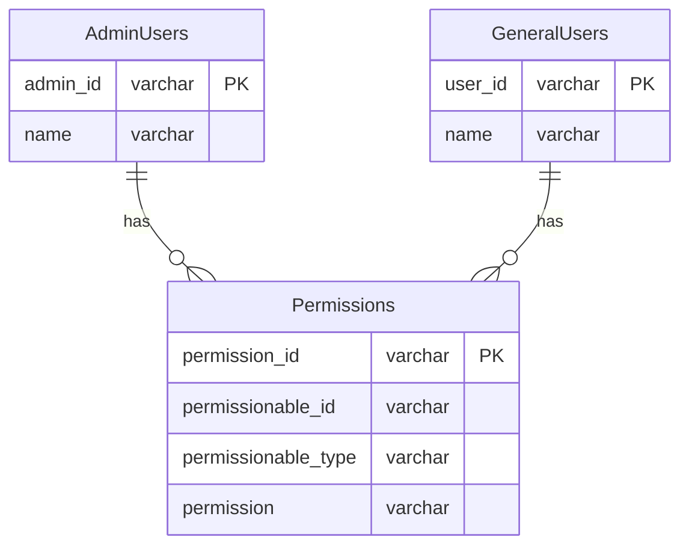
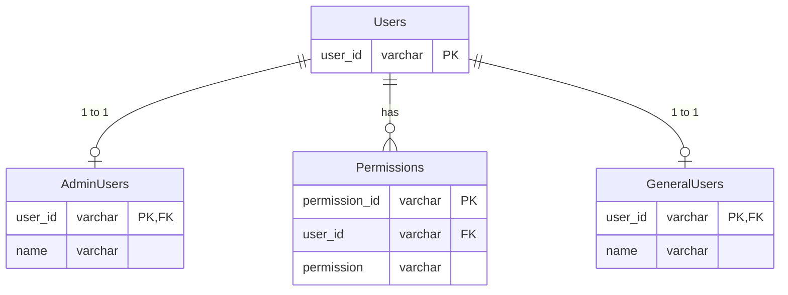
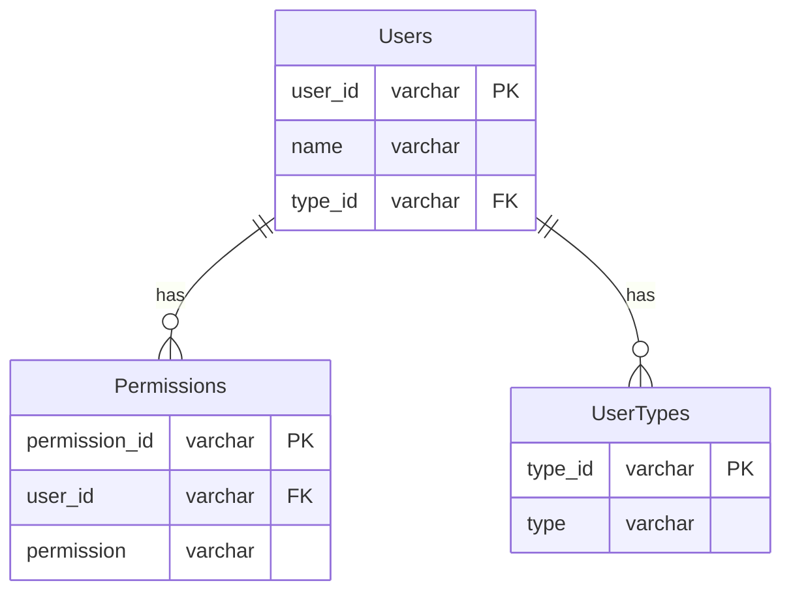

## ポリモーフィック関連
ある一つのカラムが複数のテーブルを参照しているようなパターン。
管理者ユーザーと一般ユーザーの権限を管理するDB設計で考えてみた。

## テーブル構造

`Permissions`の`permissionable_id`にAdminUsersまたはGeneralUsersの主キーが入り、
`permissionable_type`でAdminかGeneralどちらか判断している。

## 問題点
### 外部キー制約が利用できない
- 関連するテーブルが動的になってしまうのでFK(外部キー)を設定することができない。
- AdminUsers, GeneralUsersテーブルに紐付けられないデータが作られてしまう可能性がある。
- データベースの整合性を手動で管理しなければならなくなるため、エラーや不整合のリスクが高まる。

## どのように解決するか
### 共通の親テーブルの作成
`AdminUsers`と`GeneralUsers`の共通の親テーブルを作成することで、以下のような改善が可能だと考えられる。

### 外部キー制約の利用が可能
- 新しいスキーマでは、`Permissions`テーブルが`user_id`で`Users`テーブルに関連付けられているため、外部キー制約を設定でき、データの整合性を確保できるので、権限が無効なユーザーに紐付けられることを防げる。
- `Permissions`は`Users`に直接関連しており、`user_id`を利用することでどのユーザー（`Admin`か`General`）に対する権限か正確に判断できる。

-----

下記のような変更でも対応できそう。

## 参考文献
https://www.oreilly.co.jp/books/9784873115894/
