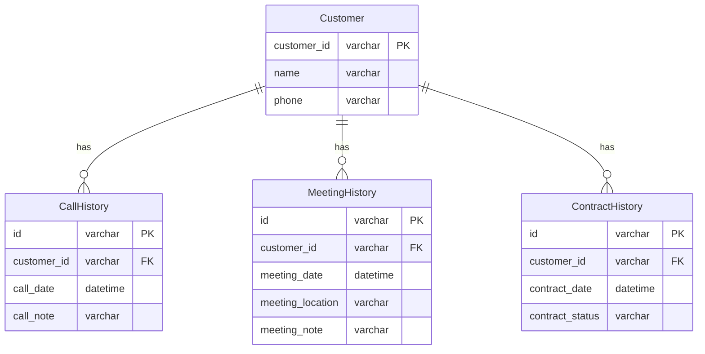

## 課題1-1

### 拡張性の問題

 より多くのイベント（電話や商談）を追跡する必要がある場合、新しい列を追加するか、古いデータを上書きしなければならないので、履歴情報を管理できない。
要件が増えるにつれてスキーマのメンテナンスが難しくなる。

### 履歴を管理することができない

- ある顧客が複数のミーティングを行った場合、現在の設計では最新の面談（metAt）しか追跡できない。顧客が過去にいつ、何回接触したり、面談したりしたかを調べることができない。
- 顧客が一度成約した後にキャンセルし、その後再び契約を成約するような履歴を管理することができない。

## 課題2-1

一つのテーブルで複数の状態を管理してしまっているので、役割ごとにテーブルを分けて管理することで拡張性を高めることや履歴の管理ができる。

- **Customer** テーブル: 顧客の基本情報を管理。
- **CallHistory** テーブル: 顧客に対する電話履歴を管理（日時、内容など）。
- **MeetingHistory** テーブル: 面談の履歴を管理（日時、場所、メモなど）。
- **ContractHistory** テーブル: 成約や商談履歴を管理(契約日、ステータスなど）。



## 課題3-1

人材管理システム

```sql

TABLE Applicant {
  id: varchar -- ID（応募者）
  currentStage: varchar -- 現在の応募ステージ（例: "書類選考", "1次面接", "最終面接", "内定"）
  interviewDate: date -- 面接の日付
  interviewFeedback: text -- 面接のフィードバック
  offerStatus: boolean -- オファーが出されたかどうか
  hiredStatus: boolean -- 採用されたかどうか
}
```

のように一つのテーブルで複数の状態を管理しようとしてしまうと同様の問題に陥ってしまう。
