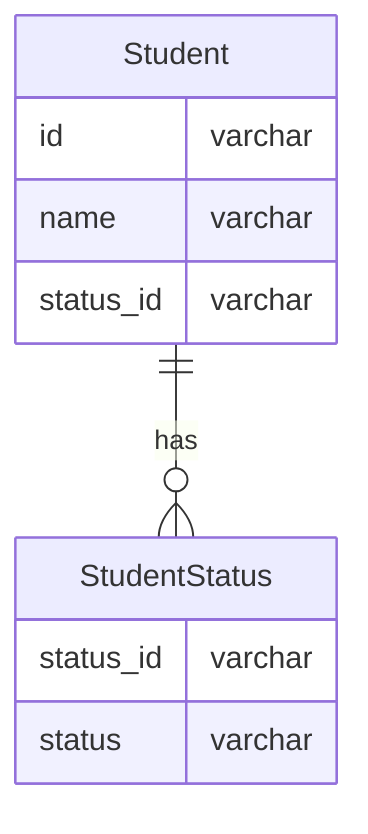
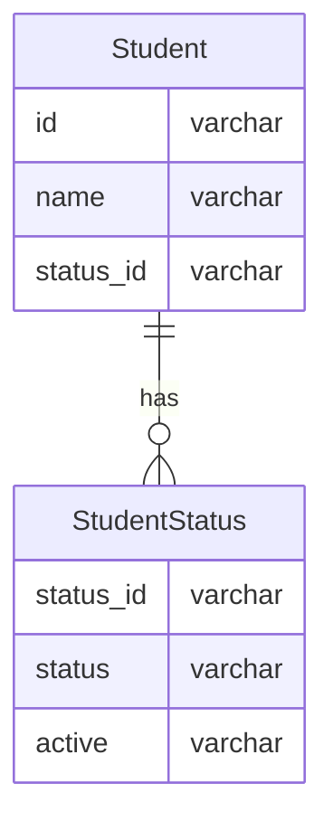

## 課題1-1
アンチパターン「サーティーワンフレーバー」にあたる

- 「studying」「graduated」「suspended」をリストとして取得したい場合、その列のメタデータを取得する必要がある

```sql
-- MySQLの場合
SELECT column_type
FROM infomation_schema.columns
WHERE table_schema = スキーマ名
	AND table_name = 'Student'
	AND column_name = 'status'
```

- 値の追加や削除など変更が困難

`CHECK`制約によって値の制限を行うことで、ステータスの追加や削除が難しくなる。
データベースによってはテーブルが空でないと列定義を変更できないものもある。

- 移行が困難

CHECK制約は各種データベース製品間で使用が統一がされていないため、異なるデータベースに移行する際に問題が発生する可能性がある。

## 課題2-1

`status`を別テーブルで管理することで、これらの問題を解消できる。



### 値の取得

SELECTで簡単に取得できる。

```sql
SELECT status FROM StudentStatus
```

### 値の変更

追加はINSERTでOK

```sql
INSERT INTO StudentStatus (status) VALUES ('abroading')
```

### 値の廃止

属性を追加することで対応できる



### 他データベースの移行もスムーズに行える

外部キー制約を用いた参照整合性の宣言という標準的なSQL機能なので移行もスムーズに行える

## 課題3-1

サッカー選手の情報を管理するサービス

```sql
TABLE Player {
  id varchar
  name varchar
  position varchar CHECK(status IN ("FW", "MF", "DF","GK"))
}
```

- 「MF」を「OMF」「CMF」などに値を変更する場合にアンチパターンに陥る
