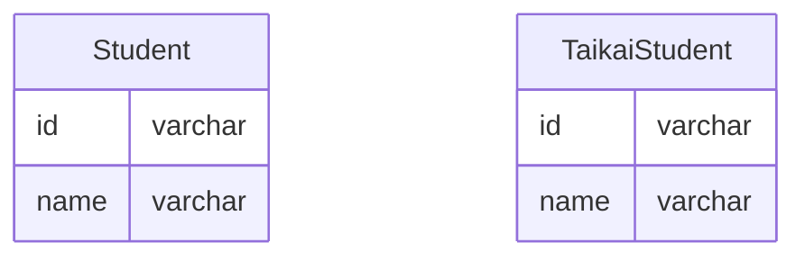

## 課題1-1

何も考えずに「削除フラグ」を利用する手法は「とりあえず削除フラグ」として知られるアンチパターン。

### クエリの複雑化

全てのテーブルに削除フラグが存在すると、必ずWHERE句に削除フラグが入ってしまい可読性が下がる。

```sql
SELECT
   *
FROM
   Student
INNER JOIN Lesson
   ON Lesson.id = Student.lesson_id
   AND Lesson.deleteFlag = 0
WHERE
   Student.taikaiFlag = 0
```

### UNIQUE制約に工夫が必要

論理削除ではデータが残り続けるため、UNIQUE制約が期待通りに機能しない可能性もある。

### カーディナリティが低くなる

多くのケースでは、削除フラグは「未削除」（`taikaiFlag = 0`）が多数派となるため、削除フラグの値に関してカーディナリティが低くなる。結果として、インデックスが効果的に機能しづらくなってしまう。

## 課題2-1

### 事実のみを保存する

退会済みのデータを別のテーブルに分けるアプローチが考えられる。現役のデータ（`Student`テーブル）と退会済みデータ（`TaikaiStudent`テーブル）を明確に分離でき、クエリのシンプル化と制約の管理が簡単になる。



### Viewを使う

すでに削除フラグがある場合は、Viewを活用する方法もある。ただ高速化にはつながらない。

```sql
CREATE VIEW ActiveStudent AS
SELECT id, name
FROM Student
WHERE taikaiFlag = 0;
```

## 課題3-1

- 過去の注文に対して問い合わせがあった場合、情報がないのでトラブルの原因になってしまう可能性がある。
- 在庫データと紐付けて管理している場合、整合性がとれなくなってしまう。
- よく購入している商品や関連する商品の紹介など、分析ができなくなってしまう。
- 大量のアクセスがあるECサイトの場合、大量のデータを一度に削除するとサイトのレスポンスが遅くなったりパフォーマンスが下がってしまう可能性も考えられる。

## 課題3-2

- 再入会した場合、以前入会していたときの進捗が分からなくなってしまう。
- 他の生徒と課題を共有できる機能があった場合、一緒に削除されてしまうなどの問題が起こる可能性が考えられる。

## 参考文献
失敗から学ぶ RDBの正しい歩き方: https://gihyo.jp/book/2019/978-4-297-10408-5
