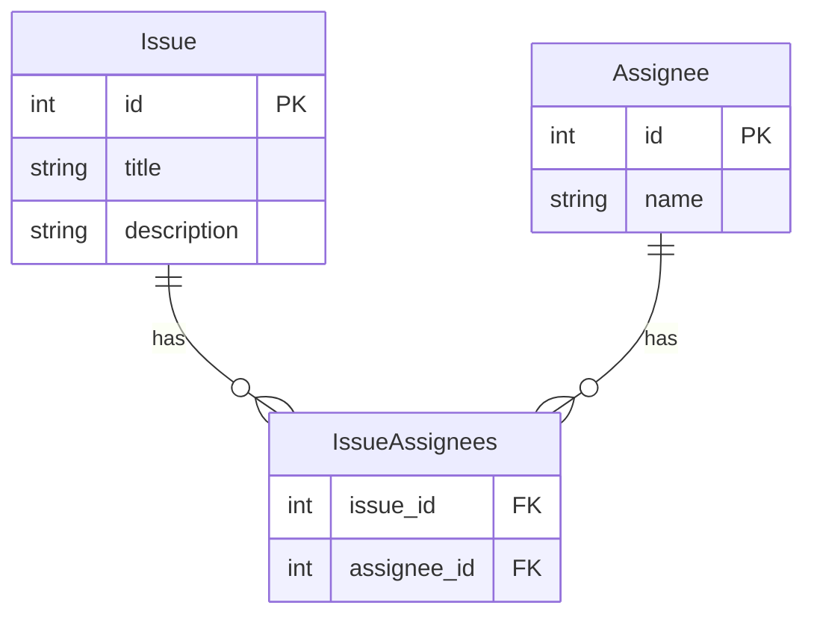

## 課題1-1

- SELECT NULL = 0;

NULL

- NULL = NULL (以下、SELECT部分を省略)

NULL

- NULL <> NULL

NULL

- NULL AND TRUE

NULL

- NULL AND FALSE

false

- NULL OR TRUE

true

- NULL IS NULL

true

- NULL IS NOT NULL

false

NULLと比較すると、結果はNULLとなってしまう。
NULLを抽出したい場合は `IS NULL` を使う。

## 課題2-1

- 中間テーブルを作成する



**Issueテーブル**

課題（Issue）に関する情報を保持。

**Assigneeテーブル（メンバーテーブル）**

担当者として割り当てることができるメンバーの情報を保持。

**IssueAssignees中間テーブル**

各Issueに割り当てられた担当者との関連を保持。
このテーブルに関連するデータがないIssueは、assignee(担当者)が割り当てられていないと判断することができる。
中間テーブルを作成することで1つのIssueに複数の担当者を割り当てることができる。

## 課題3-1

- NULLはなんのためにある？

NULLには「まだ値が存在しない」ことを示す役割もある。
デフォルト値を設定することで、意図的に設定した値なのか未設定なのか判断できなくなってしまい困ることもあるし、デフォルト値での対応も追加で必要になってくる。

- デフォルト値ではなく正規化で対応した場合は？

Joinが増えることでパフォーマンスが落ちてしまう可能性はないか一緒に考えてみる。

NULLを扱うには注意は必要だが、考えた上でNULLを使用していれば、データだけでイメージしやすくなることもあるのではないか話してみる。

## 課題4-1

- WHERE句でNULLと比較すると結果はNULLが返されるが、下記のような CASE と WHEN による条件分岐ではどうでしょうか？

```sql
CASE col
  WHEN 1     THEN '○'
  WHEN NULL  THEN '×'
END
```

- 「x」も返すように変更してください。

```sql
CASE col
  WHEN 1     THEN '○'
  WHEN NULL  THEN '×'
END
```

- Rubyでは「値がない」ことを表現したい場合、NULLではなくnilが使用されます。
「値がない」ことを表現するキーワードがNULLではない言語は他にもありますか？
