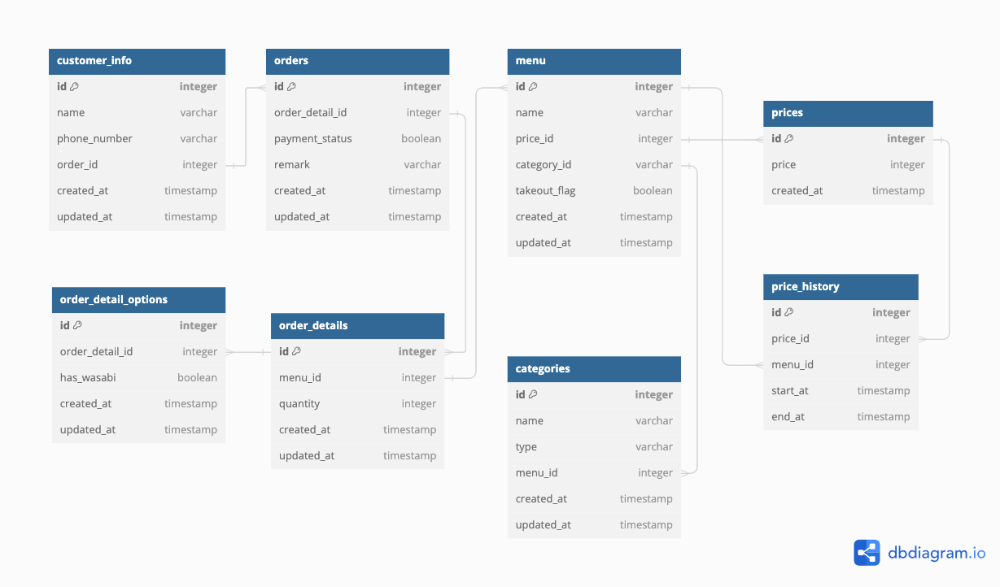

# DBスキーマ設計 スケッチ

### 顧客テーブル(customer_info)
| カラム名      | データ型  | 説明                    |
|--------------|----------|------------------------|
| id           | INT      | 主キー                  |
| name         | VARCHAR  | 顧客の名前               |
| phone_number | VARCHAR  | 顧客の名前               |
| order_id     | INT      | 外部キー 注文テーブルを参照|
| create_at    | TIMESTAMP   | 作成日         |
| update_at    | TIMESTAMP   | 更新日         |

### 注文テーブル(orders)
| カラム名        | データ型   | 説明                   |
|----------------|------------|------------------------|
| id             | INT        | 主キー                 |
| order_detail_id| INT        | 外部キー 注文詳細テーブルを参照 |
| payment_status | BOOLEAN    | 支払状態            |
| remark         | VARCHAR    | その他(備考)     |
| create_at    | TIMESTAMP   | 作成日         |
| update_at    | TIMESTAMP   | 更新日         |

### 注文詳細テーブル(order_details)
| カラム名        | データ型   | 説明                   |
|----------------|------------|----------------------|
| id            | INT        | 主キー                 |
| menu_id       | INT        | 外部キー メニューテーブルを参照 |
| quantity      | INT        | 数量                 |
| create_at    | TIMESTAMP   | 作成日         |
| update_at    | TIMESTAMP   | 更新日         |

### 適用オプションテーブル(order_detail_options)
| カラム名        | データ型   | 説明               |
|----------------|-----------|-------------------|
| id             | INT        | 主キー            |
| option_id      | INT        | 外部キー  注文詳細テーブルを参照 |
| has_wasabi     | BOOLEAN    | わさびの有無       |
| create_at    | TIMESTAMP   | 作成日         |
| update_at    | TIMESTAMP   | 更新日         |

### メニューテーブル(menu)
| カラム名      | データ型   | 説明                   |
|--------------|-----------|------------------------|
| id           | INT       | 主キー                 |
| name         | VARCHAR   | 商品の名前             |
| price_id     | INT       | 外部キー 金額テーブルを参照       |
| category_id  | INT       | 外部キー カテゴリーテーブルを参照 |
| takeout_flag | BOOLEAN   | テイクアウト可否             |
| create_at    | TIMESTAMP   | 作成日         |
| update_at    | TIMESTAMP   | 更新日         |

### カテゴリーテーブル(categories)
| カラム名        | データ型   | 説明                   |
|----------------|------------|------------------------|
| id            | INT        | 主キー                 |
| name         | VARCHAR        | カテゴリーの名前        |
| type         | VARCHAR        | セットかお好みすしか 'set', 'single'|
| menu_id  | INT        | 外部キー メニューテーブルを参照    |
| create_at    | TIMESTAMP   | 作成日         |
| update_at    | TIMESTAMP   | 更新日         |

### 金額テーブル(prices)
| カラム名       | データ型   | 説明                   |
|---------------|------------|------------------------|
| id            | INT        | 主キー                 |
| price         | INT        | 金額                 |
| create_at    | TIMESTAMP   | 作成日         |
＊prices, price_historyテーブルを作成し金額の変更を管理

### 金額履歴テーブル(price_history)
| カラム名      | データ型   | 説明                   |
|--------------|------------|------------------------|
| id           | INT        | 主キー                 |
| price_id     | INT        | 外部キー          |
| menu_id      | INT        | 外部キー            |
| start_at     | TIMESTAMP  | 開始日         |
| end_at       | TIMESTAMP  | 終了日         |
＊menu追加時に追加、menu.price_id更新時に追加、更新される

# 物理モデルと論理モデル
論理モデルはデータベースの設計図のようなもの。
どんなデータを保存するか、どう繋がっているか考える。

物理モデルは設計図を実際にどう実現するか計画すること。
どのようにデータを保存するか、どの場所に保存するか考える。
