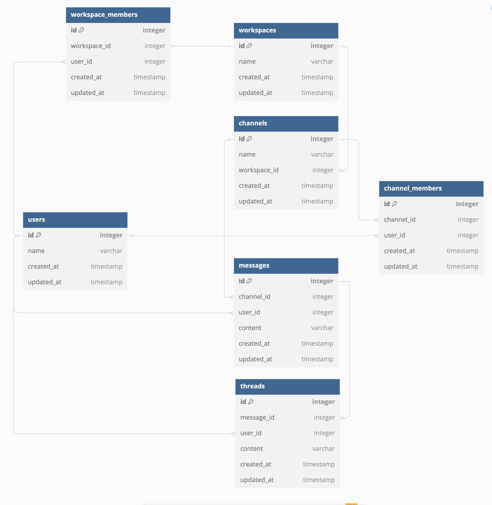

# DBスキーマ設計 スケッチ

- [ER図のリンク(dbdiagram)](https://dbdiagram.io/d/ChatTool-6670a126a179551be6186911)

### ユーザーテーブル(users)
| カラム名      | データ型  | 説明                    |
|--------------|----------|------------------------|
| id           | INT      | 主キー                  |
| name         | VARCHAR  | ユーザーの名前   |
| create_at    | TIMESTAMP| 作成日         |
| update_at    | TIMESTAMP| 更新日         |

### ワークスペーステーブル(workspaces)
| カラム名      | データ型   | 説明                   |
|--------------|----------|------------------------|
| id           | INT      | 主キー                 |
| name         | VARCHAR  | ワークスペースの名前   |
| create_at    | TIMESTAMP| 作成日         |
| update_at    | TIMESTAMP| 更新日         |

### ワークスペースメンバーテーブル(workspace_members)
| カラム名      | データ型   | 説明                   |
|--------------|------------|----------------------|
| id           | INT        | 主キー                 |
| workspace_id | INT        | 外部キー ワークスペーステーブルを参照 |
| user_id      | INT        | 外部キー ユーザーテーブルを参照      |
| create_at    | TIMESTAMP   | 作成日         |
| update_at    | TIMESTAMP   | 更新日         |

### チャンネルテーブル(channels)
| カラム名      | データ型   | 説明                   |
|--------------|----------|------------------------|
| id           | INT      | 主キー                 |
| name         | VARCHAR  | チャンネルの名前   |
| workspace_id | INT      | 外部キー ワークスペーステーブルを参照 |
| create_at    | TIMESTAMP| 作成日         |
| update_at    | TIMESTAMP| 更新日         |

### チャンネルメンバーテーブル(channel_members)
| カラム名      | データ型   | 説明                   |
|--------------|------------|----------------------|
| id           | INT        | 主キー                 |
| channel_id   | INT        | 外部キー チャンネルテーブルを参照 |
| user_id      | INT        | 外部キー ユーザーテーブルを参照   |
| create_at    | TIMESTAMP   | 作成日         |
| update_at    | TIMESTAMP   | 更新日         |

### メッセージテーブル(messages)
| カラム名      | データ型   | 説明                   |
|--------------|------------|----------------------|
| id           | INT        | 主キー                 |
| channel_id   | INT        | 外部キー チャンネルテーブルを参照 |
| user_id      | INT        | 外部キー ユーザーテーブルを参照   |
| content      | VARCHAR    | メッセージ内容         |
| create_at    | TIMESTAMP   | 作成日         |
| update_at    | TIMESTAMP   | 更新日         |

### スレッドテーブル(threads)
| カラム名      | データ型   | 説明                   |
|--------------|------------|----------------------|
| id           | INT        | 主キー                 |
| message_id   | INT        | 外部キー メッセージテーブルを参照 |
| user_id      | INT        | 外部キー ユーザーテーブルを参照   |
| content      | VARCHAR    | メッセージ内容         |
| create_at    | TIMESTAMP   | 作成日         |
| update_at    | TIMESTAMP   | 更新日         |

## 設計したテーブルのDDL
[テーブル作成](../db_modeling_2/mysql/script/DDL.sql)

## サンプルデータを投入するDML
[サンプルデータ](../db_modeling_2/mysql/script/DML.sql)

## ユースケースを想定したクエリ
[クエリ](../db_modeling_2/mysql/script/query.sql)
