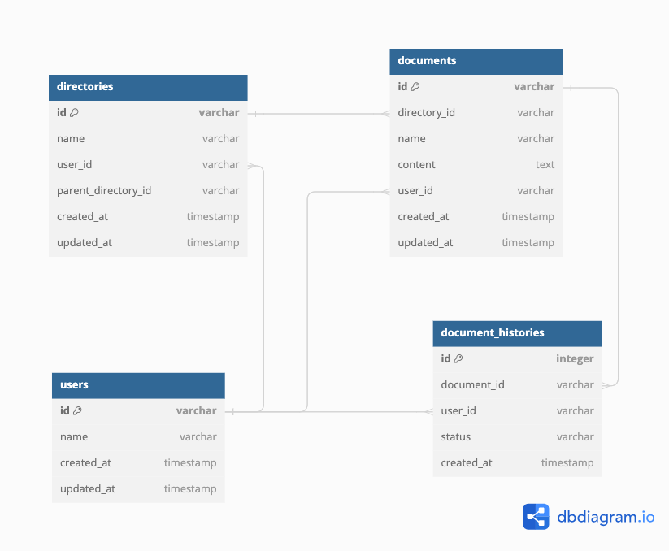

# DBスキーマ設計 スケッチ

- [ER図のリンク(dbdiagram)](https://dbdiagram.io/d/DocumentManage-66788f895a764b3c7233624f)

### ユーザーテーブル(users)
| カラム名      | データ型  | 説明                    |
|--------------|----------|------------------------|
| id           | VARCHAR  | 主キー                  |
| name         | VARCHAR  | ユーザーの名前   |
| create_at    | TIMESTAMP| 作成日         |
| update_at    | TIMESTAMP| 更新日         |

### ディレクトリテーブル(directories)
| カラム名      | データ型   | 説明                   |
|--------------|----------|------------------------|
| id           | VARCHAR  | 主キー                 |
| name         | VARCHAR  | ディレクトリの名前   |
| user_id      | VARCHAR  | 外部キー ユーザーテーブルを参照 |
| parent_directory_id| VARCHAR  | 親ディレクトリのid ルートディレクトリの場合はNULL |
| create_at    | TIMESTAMP| 作成日         |
| update_at    | TIMESTAMP| 更新日         |

### ドキュメントテーブル(documents)
| カラム名      | データ型   | 説明                   |
|--------------|------------|----------------------|
| id           | VARCHAR    | 主キー                 |
| directory_id | VARCHAR    | 外部キー ディレクトリテーブルを参照 |
| name         | VARCHAR  | ドキュメントの名前   |
| content      | TEXT     | ドキュメントの内容   |
| user_id      | VARCHAR     | 外部キー ユーザーテーブルを参照      |
| create_at    | TIMESTAMP   | 作成日         |
| update_at    | TIMESTAMP   | 更新日         |

### ドキュメント更新履歴テーブル(document_histories)
| カラム名      | データ型   | 説明                   |
|--------------|----------|------------------------|
| id           | INT      | 主キー                 |
| document_id  | VARCHAR  | 外部キー ドキュメントテーブルを参照 |
| user_id      | VARCHAR  | 外部キー ユーザーテーブルを参照  誰が更新したか |
| status       | VARCHAR  | CREATE, UPDATE, DELETE |
| create_at    | TIMESTAMP| 作成日         |

## 設計したテーブルのDDL
[テーブル作成](./script/DDL.sql)

## サンプルデータを投入するDML
[サンプルデータ](./script/DML.sql)

## ユースケースを想定したクエリ
[クエリ](./script/query.sql)
