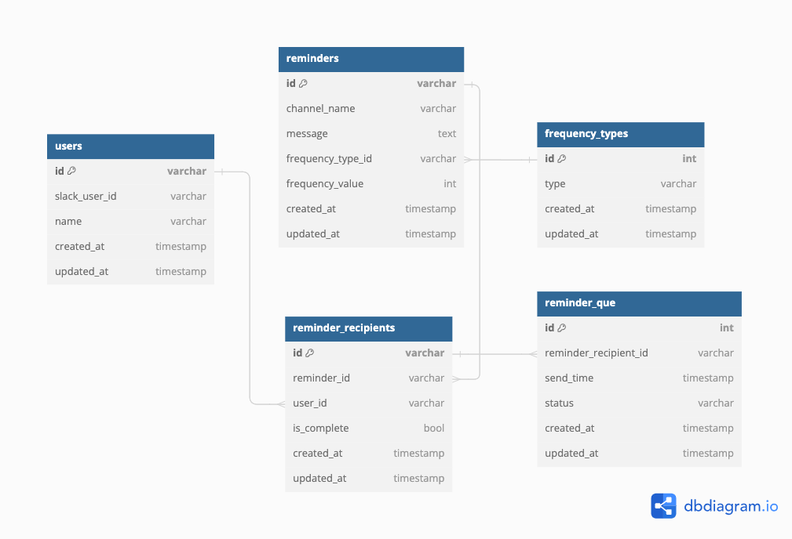

# DBスキーマ設計 スケッチ

- [ER図のリンク(dbdiagram)](https://dbdiagram.io/d/reminder-66a011958b4bb5230e276cbb)

### ユーザーテーブル(users)
| カラム名      | データ型  | 説明                    |
|--------------|----------|------------------------|
| id           | VARCHAR  | 主キー                  |
| slack_user_id| VARCHAR  | SlackユーザーID   |
| name         | VARCHAR  | ユーザーの名前   |
| create_at    | TIMESTAMP| 作成日         |
| update_at    | TIMESTAMP| 更新日         |

### リマインダーテーブル(reminders)
| カラム名       | データ型   | 説明                   |
|---------------|----------|------------------------|
| id             | VARCHAR  | 主キー                 |
| channel_name   | VARCHAR  | 送信するチャンネル名   |
| message        | TEXT     | リマインダーの文面   |
| frequency_type_id | VARCHAR  | 外部キー 周期タイプテーブルを参照 |
| frequency_value   | INT      | 周期の値（X日おきやX曜日など） |
| create_at      | TIMESTAMP| 作成日         |
| update_at      | TIMESTAMP| 更新日         |

※frequency_value
曜日指定の場合、1~7を月~日とする

### 周期タイプテーブル(frequency_types)
| カラム名      | データ型  | 説明                    |
|--------------|----------|------------------------|
| id           | INT      | 主キー                  |
| type         | VARCHAR  | 周期のタイプ（every, daily, weekly, monthly）|
| create_at    | TIMESTAMP| 作成日         |
| update_at    | TIMESTAMP| 更新日         |

### リマインダー受取人テーブル(reminder_recipients)
| カラム名     | データ型   | 説明                   |
|-------------|----------|------------------------|
| id          | VARCHAR  | 主キー                 |
| reminder_id | VARCHAR  | 外部キー リマインダーテーブルを参照|
| user_id     | VARCHAR  | 外部キー ユーザーテーブルを参照   |
| is_complete | BOOL  | タスク完了(true)、未完了(false) |
| create_at      | TIMESTAMP| 作成日         |
| update_at      | TIMESTAMP| 更新日         |

### リマインダー送信(reminder_que)
| カラム名     | データ型   | 説明                   |
|-------------|----------|------------------------|
| id          | INT      | 主キー                 |
| reminder_recipient_id  | VARCHAR  | 外部キー リマインダー受取人テーブルを参照|
| send_time   | TIMESTAMP| リマインド送信時間   |
| status      | VARCHAR  | 未送信(pending)、送信済(sent),  エラー(failed)|
| create_at      | TIMESTAMP| 作成日         |
| update_at      | TIMESTAMP| 更新日         |

## 設計したテーブルのDDL
[テーブル作成](../db_modeling_4/mysql/script/DDL.sql)

## サンプルデータを投入するDML
[サンプルデータ](../db_modeling_4/mysql/script/DML.sql)

## ユースケースを想定したクエリ
[クエリ](../db_modeling_4/mysql/script/query.sql)
