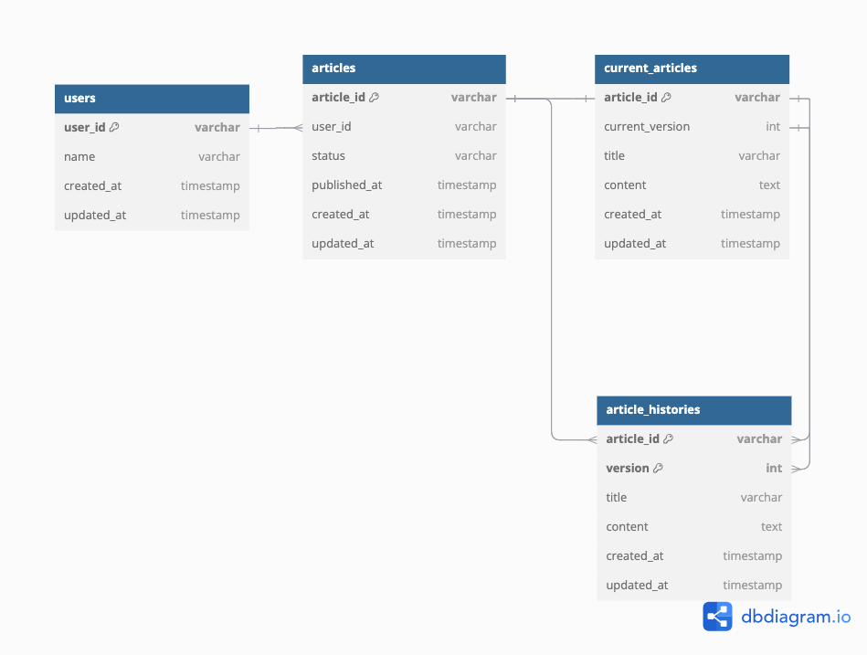
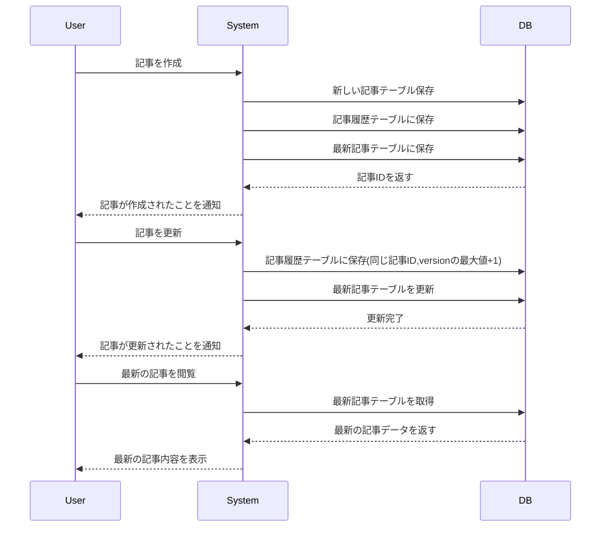

# DBスキーマ設計 スケッチ

// Note: Foreign key on (article_id, current_version) references article_histories(article_id, version)

- [ER図のリンク(dbdiagram)](https://dbdiagram.io/d/blog-66b22d458b4bb5230e600ce5)

### ユーザーテーブル(users)
| カラム名      | データ型  | 説明                    |
|--------------|----------|------------------------|
| user_id      | VARCHAR  | 主キー                  |
| name         | VARCHAR  | ユーザーの名前   |
| create_at    | TIMESTAMP| 作成日         |
| update_at    | TIMESTAMP| 更新日         |

### 記事テーブル(articles)
| カラム名       | データ型   | 説明                   |
|---------------|----------|------------------------|
| article_id     | VARCHAR  | 主キー                 |
| user_id        | VARCHAR  | 外部キー ユーザーテーブルを参照 |
| status         | VARCHAR  | 状態　"draft"(下書き)、"published"(公開済み)、"archived"(アーカイブ済み) |
| published_at   | TIMESTAMP| 公開日時 未公開の場合はnull |
| create_at      | TIMESTAMP| 作成日         |
| update_at      | TIMESTAMP| 更新日         |

### 記事履歴テーブル(article_histories)
| カラム名     | データ型   | 説明                   |
|-------------|----------|------------------------|
| id          | VARCHAR  | 主キー                  |
| article_id  | VARCHAR  | 外部キー 記事テーブルを参照|
| version     | INT      | 記事のバージョン   |
| title       | VARCHAR  | 記事のタイトル |
| content     | TEXT     | 記事の内容 |
| create_at   | TIMESTAMP| 作成日         |

### 最新記事テーブル(current_articles)
| カラム名       | データ型   | 説明                   |
|---------------|----------|------------------------|
| article_id     | VARCHAR  | 主キー 外部キー 記事テーブルを参照|
| current_version| VARCHAR  | 外部キー 現在のバージョン |
| title       | VARCHAR  | 記事のタイトル |
| content     | TEXT     | 記事の内容 |
| create_at      | TIMESTAMP| 作成日         |
| update_at      | TIMESTAMP| 更新日         |

外部キー (article_id, current_version)  article_histories(article_id, version) を参照

## 設計したテーブルのDDL
[テーブル作成](../lesson01/mysql/script/DDL.sql)

## サンプルデータを投入するDML
[サンプルデータ](../lesson01/mysql/script/DML.sql)

## ユースケースを想定したクエリ
[クエリ](../lesson01/mysql/script/query.sql)
