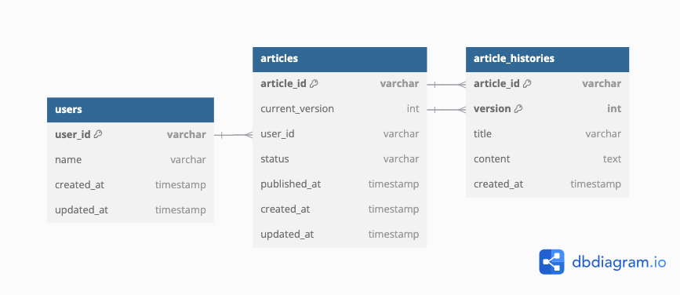
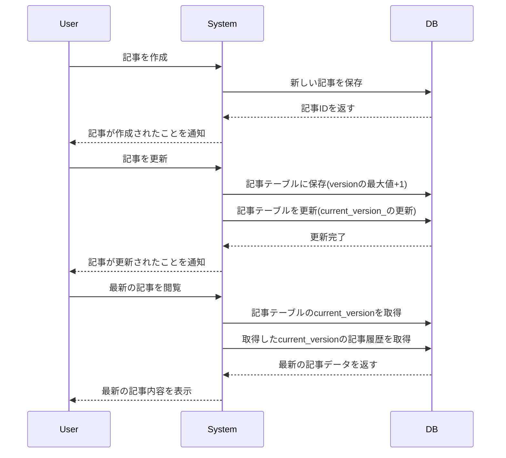

分析のみの用途や手軽に復元できなくてOKなら、ファイルやデータ分析のサービスなど別の形でも対応することは可能ではないか。

メリット
- データベースのストレージ使用量を減らし、クエリパフォーマンスを向上させることができる

デメリット
- 運用や費用のコストが増える
- データベース内のデータとの整合性を保つためには、追加の処理やチェックが必要
- 履歴データと現行データを合わせて分析する場合、データの取り出しや前処理が必要になる？

# DBスキーマ設計 スケッチ

- [ER図のリンク(dbdiagram)](https://dbdiagram.io/d/blog2-66db847aeef7e08f0ef4dfb3)

### ユーザーテーブル(users)
| カラム名      | データ型  | 説明                    |
|--------------|----------|------------------------|
| user_id      | VARCHAR  | 主キー                  |
| name         | VARCHAR  | ユーザーの名前   |
| create_at    | TIMESTAMP| 作成日         |
| update_at    | TIMESTAMP| 更新日         |

### 記事テーブル(articles)
| カラム名       | データ型   | 説明                   |
|---------------|----------|------------------------|
| article_id     | VARCHAR  | 主キー                 |
| current_version| INT      | 最新記事のバージョン   |
| user_id        | VARCHAR  | 外部キー ユーザーテーブルを参照 |
| status         | VARCHAR  | 状態　"draft"(下書き)、"published"(公開済み)、"archived"(アーカイブ済み) |
| published_at   | TIMESTAMP| 公開日時 未公開の場合はnull |
| create_at      | TIMESTAMP| 作成日         |
| update_at      | TIMESTAMP| 更新日         |

※外部キー制約 (article_id, current_version) article_historiesテーブル(article_id, version)

### 記事履歴テーブル(article_histories)
| カラム名     | データ型   | 説明                   |
|-------------|----------|------------------------|
| article_id  | VARCHAR  | 主キー 記事テーブルを参照|
| version     | INT      | 主キー 記事のバージョン   |
| title       | VARCHAR  | 記事のタイトル |
| content     | TEXT     | 記事の内容 |
| create_at   | TIMESTAMP| 作成日    |

## 設計したテーブルのDDL
[テーブル作成](../lesson02/mysql/script/DDL.sql)

## サンプルデータを投入するDML
[サンプルデータ](../lesson02/mysql/script/DML.sql)

## ユースケースを想定したクエリ
[クエリ](../lesson02/mysql/script/query.sql)
